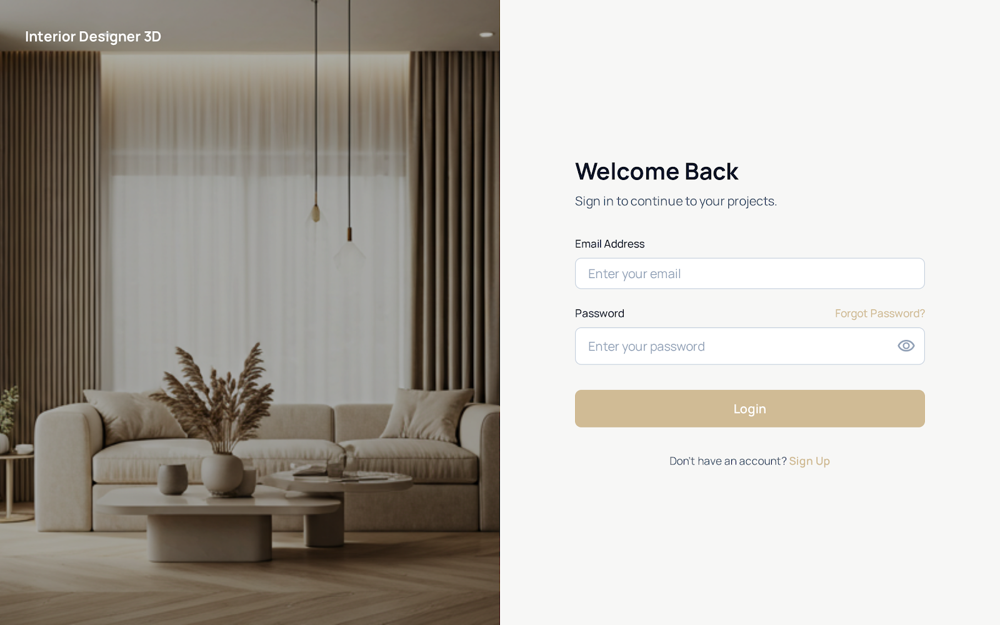

# 🏠 Interior Designer 3D

<div align="center">


**A modern, interactive 3D interior design application built with Vue.js and Three.js**

[](https://vuejs.org/)
[](https://www.typescriptlang.org/)
[](https://threejs.org/)
[](https://vitejs.dev/)

[Features](#-features) • [Screenshots](#-screenshots) • [Getting Started](#-getting-started) • [Tech Stack](#-tech-stack) • [Project Structure](#-project-structure) • [Contributing](#-contributing)

</div>

---

## ✨ Features

- 🎨 **3D Room Editor** - Create and customize interior designs in real-time
- 🪑 **Furniture Library** - Extensive collection of 3D furniture models
- 🎨 **Material Customization** - Apply different textures and materials to surfaces
- 💾 **Save & Load Designs** - Save your designs and continue working later
- 📤 **Export Options** - Export your designs in various formats
- 👤 **User Authentication** - Secure login and registration system
- 📱 **Responsive Design** - Works seamlessly on desktop and mobile devices
- 🌙 **Dark Mode** - Beautiful dark theme support
- 🎯 **Intuitive UI/UX** - Modern and user-friendly interface

## 📸 Screenshots

### Login Page


### Main Application


## 🚀 Getting Started

### Prerequisites

- Node.js (v18 or higher)
- npm or yarn
- Git

### Installation

1. **Clone the repository**
   ```bash
   git clone https://github.com/mohamedtarek64/Interior-Designer-3D.git
   cd Interior-Designer-3D
   ```

2. **Navigate to the frontend directory**
   ```bash
   cd frontend
   ```

3. **Install dependencies**
   ```bash
   npm install
   ```

4. **Start the development server**
   ```bash
   npm run dev
   ```

5. **Open your browser**
   Navigate to `http://localhost:5173` (or the port shown in your terminal)

### Build for Production

```bash
npm run build
```

The built files will be in the `dist` directory.

### Preview Production Build

```bash
npm run preview
```

## 🛠 Tech Stack

### Frontend
- **Vue.js 3** - Progressive JavaScript framework
- **TypeScript** - Type-safe JavaScript
- **Three.js** - 3D graphics library
- **Vite** - Next-generation frontend tooling
- **Pinia** - State management
- **Vue Router** - Client-side routing
- **Axios** - HTTP client

### Development Tools
- **ESLint** - Code linting
- **TypeScript** - Type checking

## 📁 Project Structure

```
interior-designer-3d/
├── frontend/
│   ├── public/
│   │   └── assets/
│   │       ├── images/          # Image assets
│   │       ├── models/           # 3D model files (.glb)
│   │       └── textures/        # Texture files
│   ├── src/
│   │   ├── components/          # Vue components
│   │   │   ├── 3DViewer/        # 3D scene components
│   │   │   ├── Auth/            # Authentication components
│   │   │   ├── Furniture/       # Furniture components
│   │   │   ├── Layout/          # Layout components
│   │   │   ├── Room/            # Room components
│   │   │   ├── Sidebar/         # Sidebar components
│   │   │   ├── Toolbar/         # Toolbar components
│   │   │   └── UI/              # Reusable UI components
│   │   ├── composables/         # Vue composables
│   │   ├── data/                # Static data
│   │   ├── plugins/             # Vue plugins
│   │   ├── router/              # Vue Router configuration
│   │   ├── services/            # API and service layers
│   │   ├── stores/              # Pinia stores
│   │   ├── styles/              # Global styles
│   │   ├── types/               # TypeScript type definitions
│   │   ├── utils/               # Utility functions
│   │   └── views/               # Page components
│   ├── package.json
│   ├── tsconfig.json
│   └── vite.config.ts
└── README.md
```

## 🎯 Key Features Explained

### 3D Scene Editor
- Interactive 3D canvas powered by Three.js
- Drag and drop furniture placement
- Real-time camera controls
- Grid system for precise alignment

### Furniture Library
- Pre-built 3D models (beds, chairs, sofas, tables)
- Easy furniture placement and manipulation
- Material customization per item

### Material System
- Multiple texture options (wood, metal, fabric, marble)
- Color picker for custom colors
- Real-time material preview

### Design Management
- Save designs to your account
- Load and continue working on saved designs
- Export designs in various formats
- Share designs with others

## 🤝 Contributing

Contributions are welcome! Please feel free to submit a Pull Request.

1. Fork the repository
2. Create your feature branch (`git checkout -b feature/AmazingFeature`)
3. Commit your changes (`git commit -m 'Add some AmazingFeature'`)
4. Push to the branch (`git push origin feature/AmazingFeature`)
5. Open a Pull Request

## 📝 License

This project is licensed under the MIT License - see the LICENSE file for details.

## 👤 Author

**Mohamed Tarek**

- GitHub: [@mohamedtarek64](https://github.com/mohamedtarek64)
- Repository: [Interior-Designer-3D](https://github.com/mohamedtarek64/Interior-Designer-3D)

## 🙏 Acknowledgments

- [Three.js](https://threejs.org/) for the amazing 3D library
- [Vue.js](https://vuejs.org/) for the fantastic framework
- All contributors and users of this project

---

<div align="center">

Made with ❤️ using Vue.js and Three.js

⭐ Star this repo if you find it helpful!

</div>
